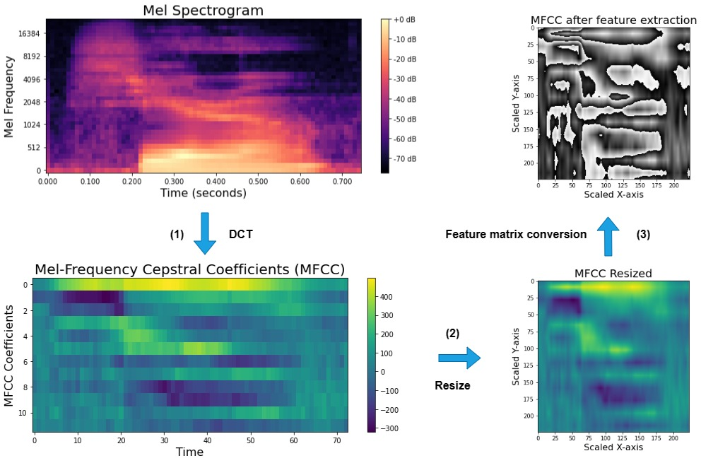
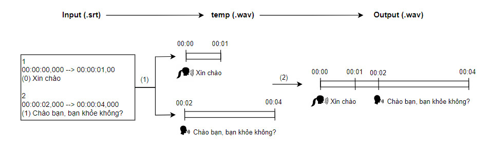
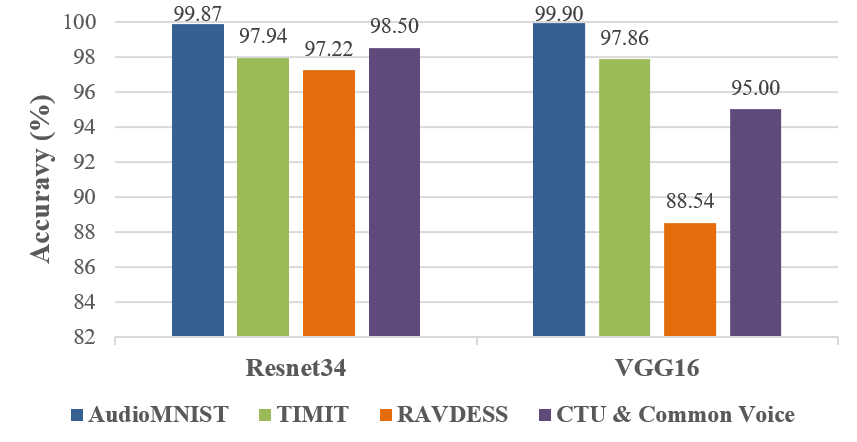
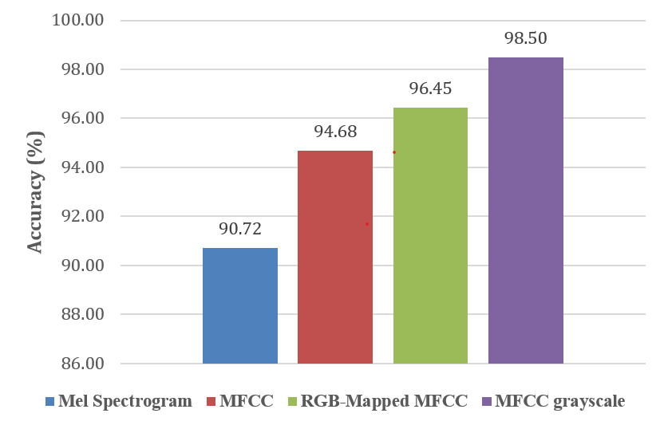
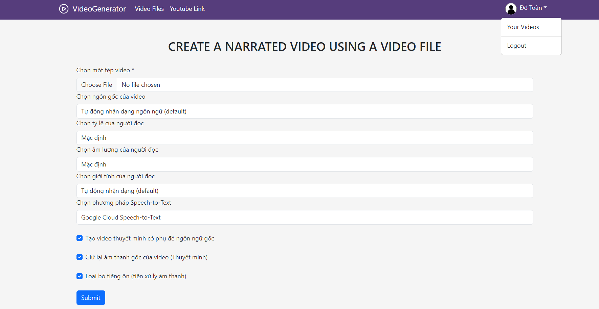
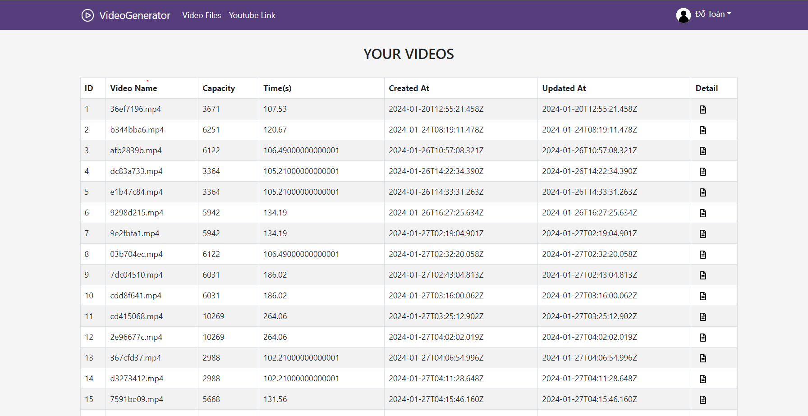
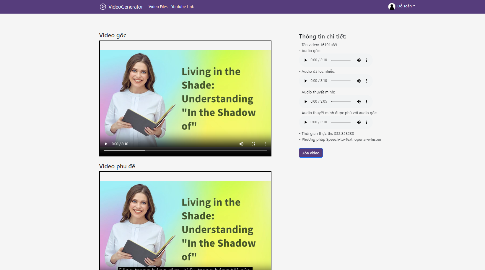

<h6 align="left">Author: <a href="https://github.com/toandokhanh">Do Khanh Toan<a/> </h6>

## Automated Processing of Video Narration Subtitles and Gender Classification Using Machine Learning

The project's purpose is to create high-quality voice-over or voice-over videos in the Vietnamese language, achieving high accuracy with a high gender classification model and subtitles while meeting the diverse needs of users.

.jpg)

#### Training process for gender classification model

#### Illustrates the steps to convert visualization types

#### Text to speech for video

## Results of gender classification model

## System interface

