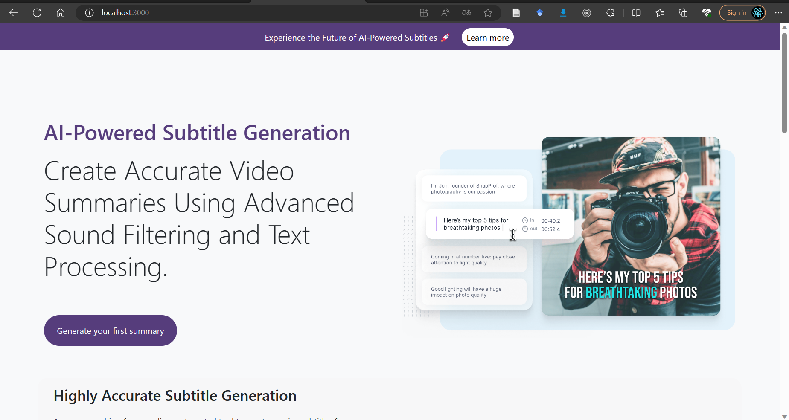
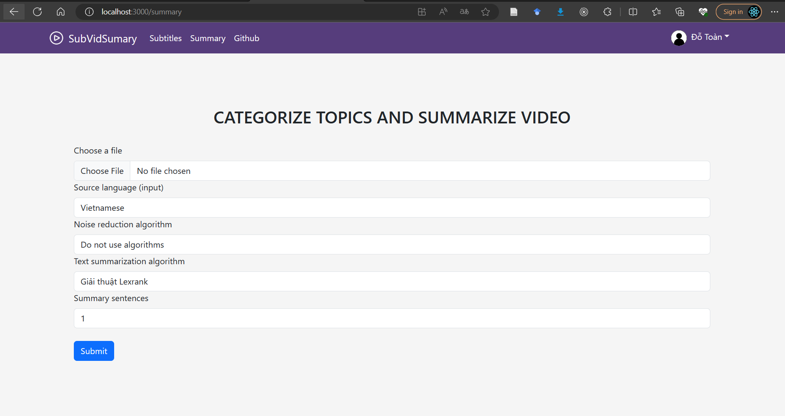
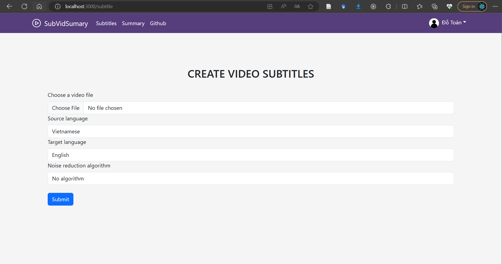
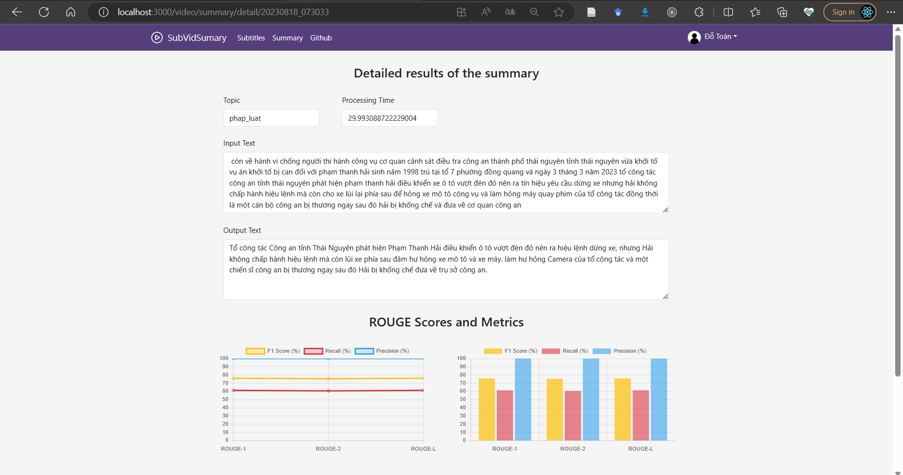
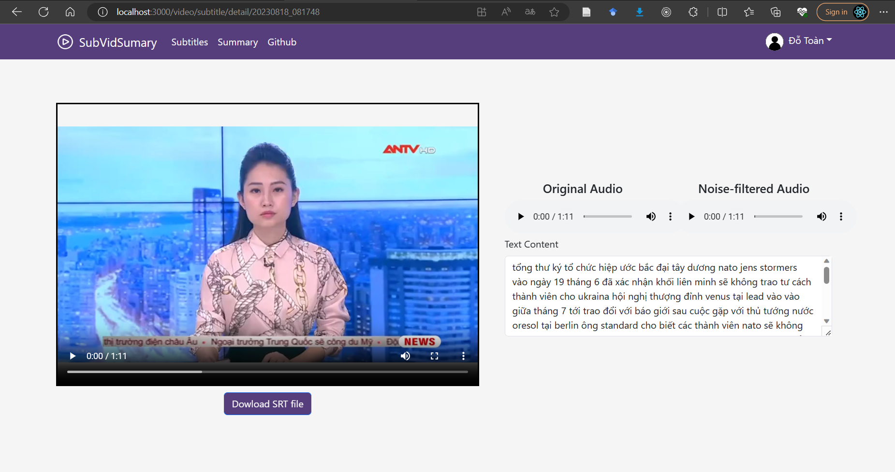

<h6 align="left">Author: <a href="https://github.com/toandokhanh">Do Khanh Toan<a/> </h6>

# SubVidSumary
This project is designed to provide a solution for generating accurate summaries and subtitles for videos based on advanced sound filtering and text processing techniques. The application combines the power of AI-driven audio analysis and natural language processing to create concise and engaging summaries that enhance video accessibility and viewer engagement.

<!--
 
 

  

 
 --->

# Getting Started
Follow these steps to set up and run the project locally on your machine:
1. fire up the Conda environment and run Flask(Python):

        conda create -n myenv

        conda activate myenv

        cd /server/python_scripts

        pip install -r requirements.txt

        python3 app.py (RUN FLASK)

2. Install project dependencies (NodeJS):
        
        cd /server

        npm install

        
3. Seed initial data (if required):

        npm run seed

4. Seed initial data (if required):
        
        npm run start

5. Start the React.js frontend (ReactJS):

        cd /client

        npm start

# Subtitle 
The general procedure to reduce noise and create subtitles for videos, as shown in the image above, includes the following steps. First, we collect videos for testing. Then we use the FFmpeg Library to extract the audio from the video files. Next, to enhance the subtitle generator, we choose DeepFilterNet (Schroter2022) or Noisereduce (Sainburg2020) to remove the noise in the audio files. We then convert the audio file format from WAV to FLAC to comply with the Speech-to-Text API requirements. Finally, we evaluate the similarity between the generated subtitles and the original text. In addition, we perform voice-based gender classification to support voiced videos for further processing.

detail: https://github.com/toandokhanh/VidSubWizard
# Summarize and auto-categorize
The internet's continuous development has led to a rise in the number of videos available online. Efficient organization and categorization based on content are important. Automatic identification of main themes in videos and text processing tasks like extraction, summarization, captions/subtitles, and sentiment analysis have growing applications. These tasks aid searchability, accessibility, and research purposes. Classifying videos by topic facilitates trend analysis and user behavior study. This paper will discuss current methods, challenges, and opportunities in video topic classification and text processing.

Detail: https://github.com/toandokhanh/Text-BasedVideoSummarizer

# System Description

# License
This project is licensed under the MIT License - see the LICENSE file for details.
